# 📌 Ataque de ARP Spoofing con Ettercap

## Descripción
Este proyecto ilustra un ataque de ARP Spoofing usando la herramienta Ettercap disponible en la distribución de Kali Linux.

Para ilustrar este ejemplo, se ha diseñado un etorno virtualizado usando una máquina Kali Linux 2024, que actuará como atacante malicioso dentro de la red. Así mismo, se utilizará otro dispositivo de prueba conectado a la misma red sobre el que se realizará el ataque.

## Objetivo 
El objetivo es analizar la efectividad del ataque atendiendo a diferentes protocolos, comparando el uso de HTTP (acceso inseguro) con el de HTTPS (acceso seguro) y discutir las posibles soluciones para prevenir y hacer más segura la red.

## 🌐 Diseño de la red
La red empleada para ilustrar este ataque sera una red doméstica que utiliza el conjunto de direcciones IP `192.168.100.0/24`.

Dentro de ella, podremos encontrar los siguientes dispositivos
- 🖥️ Dispositivo `Android` que hará de usuario interceptado (cualquier dispositivo de la red nos valdría).
- ⚔️ Máquina virtual `Kali Linux 2024` actuando como atacante, interceptando el tráfico del usuario comprometido.

Será necesario que la máquina virtual kali tenga configurada su interfaz de red en modo **Adaptador Puente** usando una dirección IP estática.

## 🛠️ Tecnologías usadas
- Oracle Virtual Box
- Wireshark
- Ettercap 
- Python 

# Configuración de la red
Todos los dispositivos se conectan mediante la red LAN. El primer paso es configurar las direcciones IP de todos ellos y verificar la conectividad usando un ICMP ping.

La máquina atacante Kali fue configurada con su adaptador de red en modo **Adaptador puente**, esto es importante ya que si no, el router no podrá darle una dirección IP y por lo tanto, no actuará como si fuera un dispositivo más dentro de la red.

Para simplificar el proceso, estas serán las direcciones IP asociadas a los distintos dispositivos. En el caso de la máquina Kali, esto se hace accediendo a la configuración de red. En el caso del otro dispositivo (en este caso Android), la dirección IP será asociada por el router empleando el protocolo DHCP, que se podrá conocer a través de la pestaña de configuración de red.

- El dispositivo Android tendrá la dirección IP `192.168.100.250/24`.
- La máquina Kali tendrá la dirección IP `192.168.251/24`. 

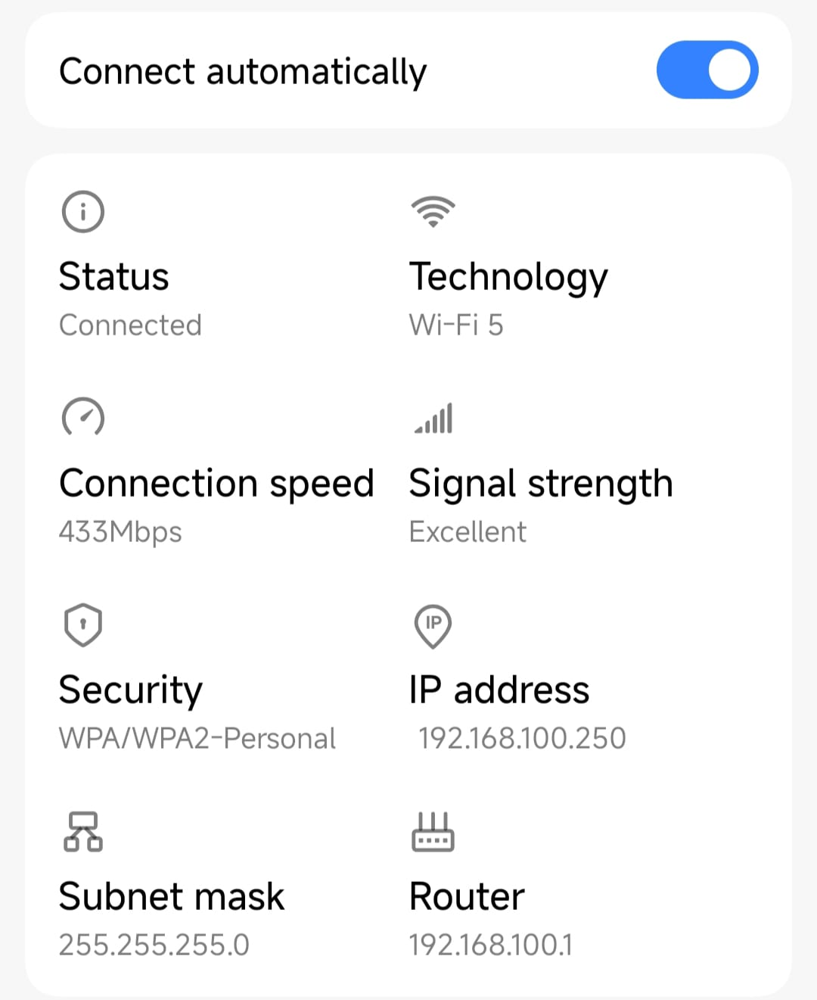
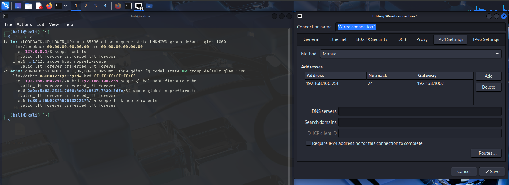

La conexión entre ambos dispositivos se probará usando el comando `ping`. La conexión será respondida de forma exitosa, confirmando que están conectados a la misma LAN. Este es el esquema de red propuesto:

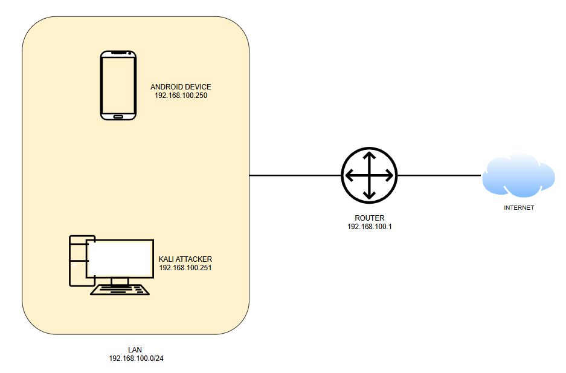

# Configuración del servidor HTTP
La configuración del servidor HTTP se hace usando Python mediante el siguiente comando en una terminal:

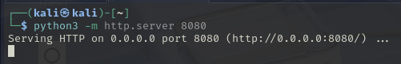

De esta manera, al haber recibido una dirección IP propia, podremos conectarnos al servidor desde cualquier dispositivo **dentro** de la red escribiendo `192.168.100.251:8080`. 

# Ataque de ARP Spoofing con el protocolo HTTP
## Definición de ARP Spoofing
**ARP Spoofing** es un tipo de ataque de ruta (también conocido como hombre en el medio) en el que se lleva a cabo una suplantación de identidad manipulando el protocolo ARP de una LAN, permitiendo así la interceptación de la comunicación entre dispositivos dentro de la misma red.

El protocolo **ARP** es responsable de mapear direcciones IP a direcciones MAC en una red de área local.
En circunstancias normales, los dispositivos de una red tienen una tabla ARP para conocer qué direcciones MAC corresponden a cada dirección IP. En este tipo de ataque, esa tabla se manipula por el atacante, que envía respuestas ARP a otros dispostivos en la red, asociando sus propias direcciones MAC con la dirección IP de otros dispositivos.
Como resultado, los dispositivos afectados actualizan sus tablas ARP con información incorrecta y empiezan a enviar tráfico de red a los atacantes en vez de al receptor real.

## Ataque
Para llevar a cabo el ataque, será necesario primero configurar Ettercap. Para ello, se inicializa en modo gráfico en la máquina atacante Kali usando ``sudo ettercap -G``:

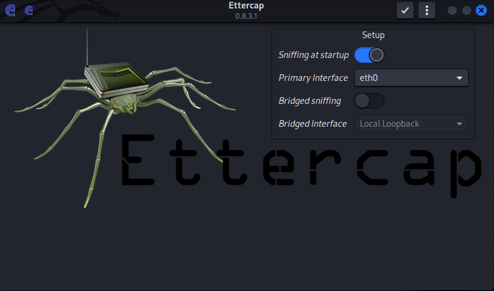

Hay que asegurarse de que la interfaz de red seleccionada es la correcta, como solo hay una que es ``eth0``, se deja la configuración como está, en caso contrario habría que seleccionarla.

A continuación, se acepta la configuración actual dando click en el botón con el **✓** arriba a la derecha hasta que aparezca el mensaje "Starting Unified Sniffing".

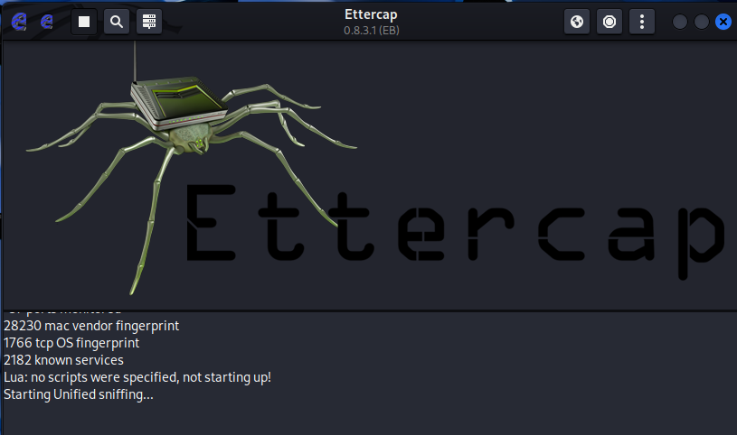

Ahora es necesario configurar los parámetros de Ettercap, entre los que se encuentran las direcciones IP comprometidas.

Ettercap funciona estableciendo dos "targets". Por un lado, el **"target 1"** será el dispositivo sobre el cuál se va a realizar el ataque y por otro, el **"target 2"** será el dispositivo que se quiere suplantar.

Para este ejemplo, a máquina Kali se hará pasar por el router para interceptar toda el tráfico de red, de modo que los targets se configuran como sigue:
- ``Target 1``: 192.168.100.250 (dirección IP del dispositivo Android).
- ``Target 2``: 192.168.100.1 (dirección IP de la puerta de enlace predeterminada de la red).

Para configurar esto, hay que establecer el parámetro "Hosts" de la configuración de Ettercap:

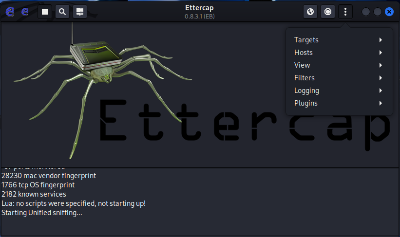

Y posteriormente, en "Host List" podremos identificar todos los dispositivos activos en la red:

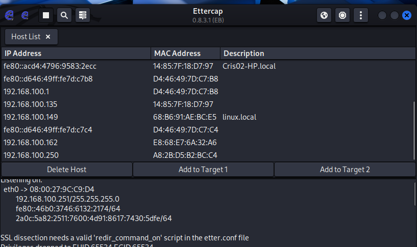

En este punto, habrá que seleccionar las dos direcciones IP necesarias y hacer click en "Add to Target 1" y "Add to Target 2" según corresponda:

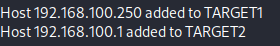

Cuando los dispostivos estén seleccionados, se establece el ataque dando click en el icono del planeta de arriba a la derecha y seleccionando "ARP Poisoning" y después "Sniff remote connections":

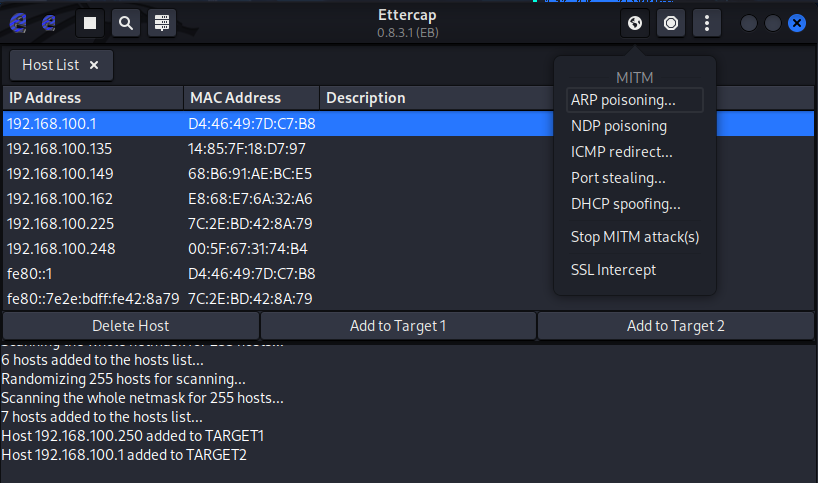

Una vez que el atacante se establece en comunicación entre los dispositivos, este puede interceptar información sensible, modificar el tráfico o lanzar otros ataques.
En este punto, se asume que el atacante ha ganado acceso a la red y está operando dentro de la misma LAN que los dispositivos.

### 📦 Análisis de interceptación de paquetes
La herramienta usada para analizar e interceptar el tráfico de red es Wireshark. Este nos permite capturar y analizar los paquetes de red en tiempo real, proporcionando información relativa a las direcciones IP origen y destino, protocolos usados, longitud de paquete y otros detalles.

El **dispositivo Android** inicializa una **conexión HTTP** accediendo al servidor creado en la máquina Kali a través de un navegador. Este acceso queda registrado en Wireshark:

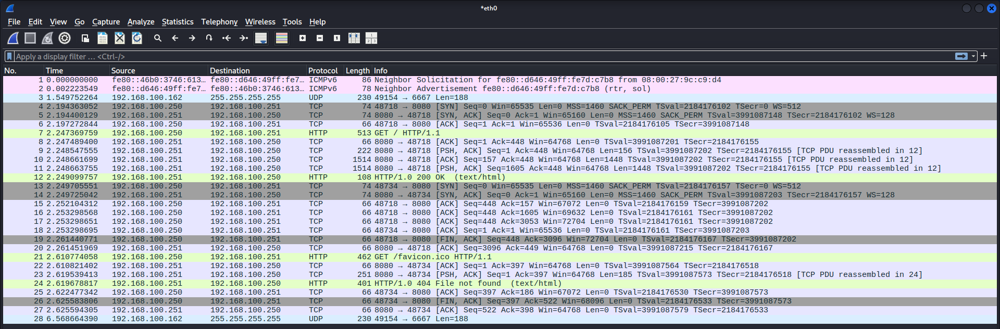

En donde podemos ver el establecimiento de la conexión gracias al mensaje ``"HTTP/1.0 OK"``:

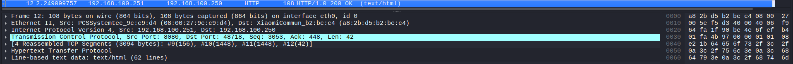

# Configuración del servidor HTTPS

Para ese caso no es necesario configurar nada más del servidor de Python, puesto que accediendo a cualquier web certificada se establecerá un acceso mediante el protocolo HTTPS.

## Ataque
Tras haber accedido a una página, se vuelve a lanzar una nuevo ataque de suplantación de identidad para comprobar el comportamiento del protocolo HTTPS.

Al analizar el tráfico en Wireshark, tal y como aparece en la imagen anterior, este aparecerá cifrado, haciendo más difícil al atacante leer el contenido, sin embargo sí que se puede ver cierta información,como que se estaba accediendo a la Wikipedia.  Este tipo de comunicación es signifcativamente más segura que usando HTTP.

Sin embargo, el riesgo sigue presente. Aunque el desencriptado del mensaje es difícil, este tipo de ataque puede ser todavía usado como punto de partida para amenazas más serias.

Un ejemplo sería el uso de la herramienta ``Evilginx`` que permite hacer ataques de suplantación de identidad falisicando sitios web con certificados oficiales.

# Posibles riesgos de ataques de ARP Spoofing

## 🕵 Ataque de ruta (MITM)
- Robo de credenciales
- Falsificación de identidad
- Tráfico de datos sensibles

## 🚨 Suplantación de sesión
Un atacante puede robar cookies de sesión o tokens y falsificar la sesión de un usuario.

## 🛡️ Denegación de servicios
El atacante puede redireccionar tráfico a una dirección IP ajena, provocando un fallo en la comunicación.

## 👿 DNS Spoofing
El atacante intercepta solicitudes DNS y redirecciona al cliente a una web falsificada, provocando ataques de **phishing** o instalación de malware.

# Mitigaciones
Los ataques de suplantación de identidad pueden prevenirse a través de implementaciones robustas de medidas de seguridad en la red y el uso de buenas prácticas.

Para proteger contra los ataques de ARP Spoofing, se pueden considerar las siguientes medidas:

- **Uso de entradas ARP estáticas**:
Para servicios críticos y dispositivos, usar entradas ARP estáticas en la tabla ARP asegura que las direcciones MAC permanezcan intactas.

- **Activar inspección ARP dinámica**:
En los conmutadores, DAI es una herramienta de seguridad que portege contra ataques de ARP. Intercepta todos los paquetes ARP y los valida. Si un paquete ARP no coincide, se rechaza.

- **Uso de protocolos de encriptación**:
Es esencial el uso de protocolos que aseguren que aunque un paquete sea interceptado, permanezca ilegible para el atacante.

- **Segmentación de red**:
Aislar dispositivos críticos del resto de la red en redes virtuales limita la capacidad del atacante para acceder a ellos.

- **Monitorización de las tablas ARP**: Los cambios en las tablas ARP implican actividad maliciosa. El uso de herramientas de monitorización que alerten en esos casos debe ser necesario.

- **Filtrado de paquetes**.
- **Uso de firewalls**.
- **Seguridad de puertos**.
Los switches pueden ser configurados para acceder únicamente a un número limitado de direcciones MAC por puerto, ayudando a detectar ataques de "ARP Spoofing".

- **Educación de los usuarios**
Es necesario educar a los usuarios para prevenir ataques de ingeniería social, reduciendo así las posibilidades de no ser capaz de identificar el comportamiento de una red.

# Agradecimientos
Este post está escrito basándome el artículo de **Miriam Lozano** que también explica en qué consiste un ataque de suplantación de indentidad usando la herramienta ``arpspoof`` y un servidor Apache. Ese artículo puede revisarse [aquí](https://github.com/MiriamLozano/arp-spoofing-lan-analysis?tab=readme-ov-file).
